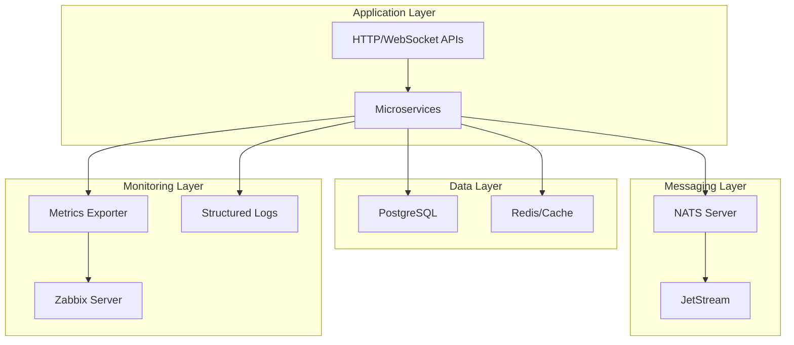

# NATS Microservices Framework

A comprehensive, production-ready microservices framework built on [NATS](https://nats.io) with integrated monitoring, structured logging, and comprehensive testing capabilities.

## Overview

This framework combines the elegance of [Nameko](https://nameko.readthedocs.io/)'s decorator-based service definitions with the high-performance, cloud-native messaging of NATS. It provides everything you need to build, deploy, and monitor microservices at scale.

## Key Features

### 🚀 **High-Performance Messaging**
- Built on NATS for microsecond latency and millions of messages/second
- Automatic reconnection and fault tolerance
- JetStream support for persistent messaging and exactly-once delivery

### 🎯 **Developer-Friendly API**
- Decorator-based service definitions inspired by Nameko
- Type-safe RPC calls with Pydantic schema validation
- Broadcast/listener patterns for event-driven architecture

### 🌐 **Multi-Protocol Support**
- NATS messaging for service-to-service communication
- HTTP/REST APIs via FastAPI integration
- WebSocket support for real-time communication
- Automatic relay of NATS events to WebSocket clients

### 📊 **Production Monitoring**
- Zabbix integration with pre-built dashboards
- Automatic metrics collection and export
- Container and application-level monitoring
- Custom metrics via HTTP endpoints

### 📝 **Structured Logging**
- JSON-structured logs via Loguru
- Contextual logging with request tracking
- Automatic log rotation and compression
- Integration with monitoring systems

### 🧪 **Comprehensive Testing**
- Unit tests with pytest and async support
- Integration tests for service interactions
- Mock NATS clients for isolated testing
- Test fixtures and utilities

### 🐳 **Container-Ready**
- Docker and Docker Compose configurations
- Auto-restart capabilities for resilience
- Graceful shutdown handling
- Health checks and monitoring endpoints

## Architecture



## Quick Example

```python
from nats_service_extended import HTTPService, ServiceConfig
from nats_service_extended import validated_rpc, broadcast, listener
from pydantic import BaseModel

# Define message schemas
class CreateUserRequest(BaseModel):
    username: str
    email: str

class UserCreatedEvent(BaseModel):
    user_id: str
    username: str

# Create a service
class UserService(HTTPService):
    def __init__(self):
        config = ServiceConfig(name="user_service")
        super().__init__(config, port=8001)
        
        # Add HTTP endpoint
        @self.post("/users")
        async def create_user_http(request: CreateUserRequest):
            return await self.create_user(request)
    
    @validated_rpc(CreateUserRequest, dict)
    async def create_user(self, request: CreateUserRequest):
        # Create user logic here
        user_id = f"user_{hash(request.username)}"
        
        # Broadcast event
        await self.broadcast_user_created(user_id, request.username)
        
        return {"user_id": user_id, "status": "created"}
    
    @broadcast(UserCreatedEvent)
    async def broadcast_user_created(self, user_id: str, username: str):
        return UserCreatedEvent(user_id=user_id, username=username)

# Listen for events in another service
class NotificationService(HTTPService):
    @listener(UserCreatedEvent)
    async def on_user_created(self, event: UserCreatedEvent):
        print(f"Sending welcome email to user {event.username}")

# Run the services
if __name__ == "__main__":
    from nats_runner import MultiServiceRunner
    
    runner = MultiServiceRunner()
    runner.add_service(UserService, ServiceConfig(name="user_service"))
    runner.add_service(NotificationService, ServiceConfig(name="notification_service"))
    runner.run_forever()
```

## What's Included

This framework provides:

- **Core Framework**: Base service classes, decorators, and message patterns
- **Extended Features**: HTTP/WebSocket services, schema validation, broadcast/listener patterns
- **Monitoring Stack**: Zabbix server, agent, and custom metrics collection
- **Logging System**: Structured logging with Loguru and contextual information
- **Testing Suite**: Unit and integration tests with fixtures and utilities
- **Documentation**: Comprehensive guides and API reference
- **Examples**: Real-world examples and deployment configurations

## Getting Started

1. **Installation**: Set up the framework and dependencies
2. **Quick Start**: Build your first service in minutes
3. **Configuration**: Customize the framework for your needs
4. **Deployment**: Deploy to production with monitoring

[Get Started →](getting-started/installation.md){ .md-button .md-button--primary }

## Community & Support

- 📖 [Documentation](.)
- 🐛 [Issue Tracker](https://github.com/your-username/cultku/issues)
- 💬 [Discussions](https://github.com/your-username/cultku/discussions)
- 📧 [Mailing List](mailto:support@your-domain.com)

## License

This project is licensed under the MIT License - see the [LICENSE](../LICENSE) file for details.