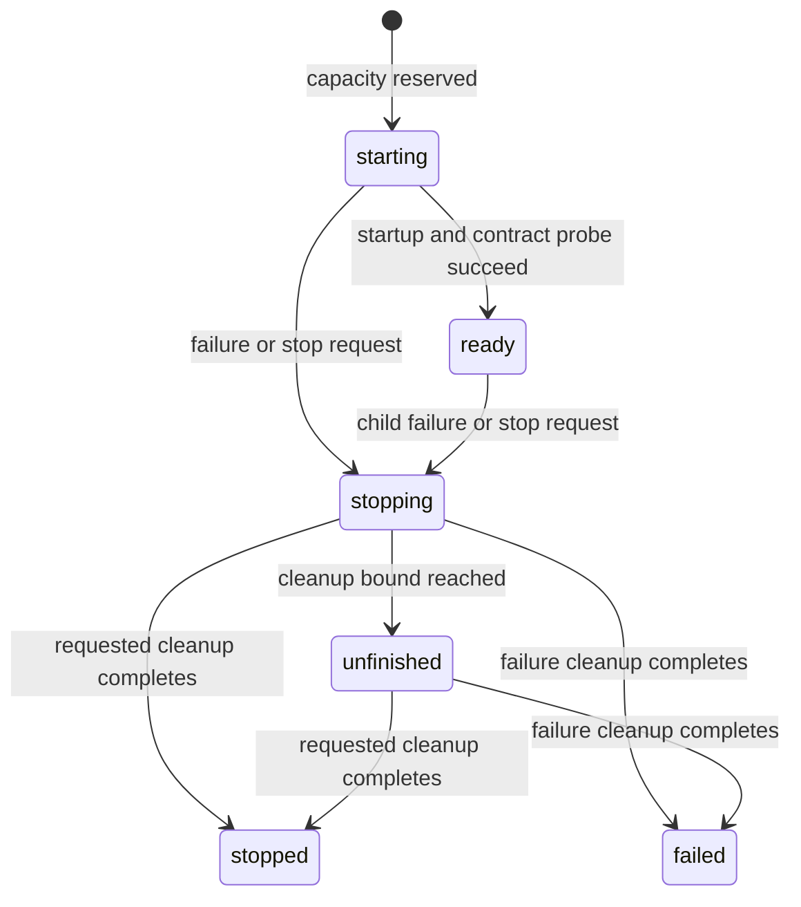

# Virtual services and local supervision

**Status: Accepted for local supervision.** This document defines the local
ownership and lifecycle contract. The [local supervisor reference](local-supervisor.md)
describes its installed API and the [order/shipment example](../examples/virtual_services/README.md)
demonstrates parent ownership and generated clients. Persistent identities and
placement across hosts remain proposed work.

An order service can request a shipment worker for a particular batch, call it
through a generated client, and release it when the batch finishes. The worker
has its own address and lifecycle. Its interface is known before it starts.
The same arrangement suits a reviewer assigned to one change or a tool adapter
assigned to one project.

The first delivery is an optional supervisor for services sharing one process.
Explicit activation establishes the ownership and cleanup rules that persistent
identities and placement across hosts can build upon.

## Terms

| Term | Meaning |
| --- | --- |
| Template | A registered service class, typed settings, fixed RPC contract, revision and local construction factory. |
| Logical identity | The tuple `(scope, template, key)`, such as an application's shipment worker for batch `batch-42`. |
| Activation | One live attempt to serve a logical identity, with its own generation and RPC address. |
| Activation reference | An immutable handle containing supervisor incarnation, logical identity, generation, template revision, contract identity, address and bound output routes. |
| Owner | A supervisor-issued lifetime under which children are admitted and stopped. |
| Virtual service | A logical identity whose successive activations can be managed independently of its callers. |

A template revision identifies an application deployment choice; it is separate
from the Cliffracer package version. A scope separates application identities;
broker credentials and application policy establish authorization.

## Placement in the framework

`LocalSupervisor` belongs alongside the runners and is constructed explicitly
by the application host. The host owns its async lifetime and registers the
available templates. Application wiring supplies parent services with owner
handles. A thin extension adapter can close an owner during its parent's
teardown using the existing extension lifecycle.

The supervisor calls each child's async `start()` and `stop()` methods directly.
Process signals and the event loop belong to the host. Children are ordinary
service instances with ordinary dispatch, correlation, validation and configured
RPC concurrency. A single activation can serve concurrent requests when its
template permits them.

The initial registry lives in memory, and each supervisor is the only authority
over its own records. Each supervisor incarnation has a distinct identifier.
Independent supervisors can host the same logical key; coordinating ownership
across those supervisors requires a separate distributed ownership protocol. A
host restart starts a fresh registry and invalidates its activation references.

In-process children share the event loop, memory and process failure boundary.
Blocking application code can stall the host. Subprocess hosting is a distinct
placement capability with its own start, stop and evidence requirements.

## Templates and typed clients

A registered template contains:

- A stable template identifier and immutable revision.
- A concrete `CliffracerService` subclass, its RPC contract and any declared
  [typed output contracts](typed-outputs.md).
- A settings model that accepts and normalizes instance configuration.
- A local factory receiving validated settings and host-assigned runtime
  configuration and returning a fresh instance of the registered class.
- Startup and cleanup budgets and the service's dispatch limits.

Registration validates the class and settings model. Catalog entries are keyed
by template identifier and revision, so several fixed revisions can coexist.
The template contract contains the complete RPC method set and canonical
signature hashes, including
referenced model schemas. Each revision is frozen for the registry's lifetime.
Changes to the class or its RPC shape require a new registered revision.

Settings are copied into normalized data before comparison or construction, so
later mutation of a caller's object cannot change an accepted request. A factory
receives its own settings instance.

The host assigns the child's broker connection policy, namespace, activation
name and health listener address. Application settings describe business inputs,
such as a warehouse or model selection. Construction verifies the returned
class and assigned runtime fields before starting it. Returning an already
started or already owned instance is refused without stopping its existing
owner's work. Factories perform construction; owned resources are acquired
during the supervised startup.

This uses an explicit factory contract because self-configuring service
construction preserves a service's own name when applying configuration
overlays. Dynamic identity must be present before startup binds subscriptions
and resources.

The first template surface covers RPC handlers and service lifecycle hooks.
Registration refuses declared event listeners, including validated listeners
and broadcast handlers, and declared timers, with an error naming the
unsupported declaration. Ordinary worker hooks can compose through the existing
extension contract. Supporting a wider template surface requires explicit rules
for its subscriptions, timers and resource ownership.

Generate one client from the template's service class. Bind that client to an
activation with the existing `ServiceClient` constructor's `service=` and
`namespace=` arguments. Instance settings keep the same RPC contract. Readiness
compares the complete live method set and signatures with the template; a
whole-description hash includes documentation metadata and is therefore
unsuitable as the RPC contract identity.

A template's typed client defines business operations. Supervisor operations
use their own control contract; arbitrary method names and free-form arguments
are unnecessary for activation.

## Logical identity and routing

The logical identity maps to a record with normalized settings, template
revision, owner, current generation and lifecycle state. Matching settings are
compared as normalized data. A request with a different owner, revision or
settings for an existing identity is refused with a conflict rather than
changing the record's meaning.

The supervisor generates an opaque routing name from its incarnation and the
activation identifier using the normal subject validation rules. Callers use
the returned address instead of deriving it from the business key. Each new
activation gets a new address, including reactivation after a clean stop.

An activation reference stays pinned to its generation. Its RPCs retain that
address, and its control operations include the incarnation and generation.
A stale reference cannot stop a replacement or route a delayed request to it.
Getting a fresh reference is an explicit operation.

Interchangeable replicas retain the ordinary service queue-group model. A
dedicated activation gets its own queue-group address and represents one
logical service. These modes have different ownership contracts.

## Control operations

These are interface shapes, expressed as notation rather than executable code:

```text
register(template)                         -> registered template
open_owner(scope, parent=...)              -> owner handle
ensure(owner, template, key, settings, revision=...) -> ready reference or retained outcome
inspect(logical_identity)                  -> activation snapshot or unknown
list_activations(scope, cursor, limit)       -> bounded snapshot page
stop(activation_reference)                 -> cleanup outcome
reactivate(owner, terminal_reference)       -> new ready activation reference
close_owner(owner)                         -> bounded cleanup report
close()                                    -> bounded cleanup report
```

`open_owner` issues an opaque identity; possession follows application wiring.
It also records ancestry for child owners. Parent closure closes descendant
owners. A supervisor-owned lifetime is an explicit choice and lasts at most
until supervisor shutdown. Ownership transfer requires a separate contract.

`ensure` validates the request, checks that its owner is open and atomically
reserves an activation slot before publishing a `starting` record. Construction
and startup run in supervisor-owned tasks, and admission and state changes run
without awaits on the owning event loop. Concurrent matching calls await that
same work. A caller's cancellation or wait timeout ends its own wait and leaves
accepted work owned by the supervisor.

A bounded startup budget belongs to the activation, independently of caller
waits. Retry of a matching `ensure` finds the retained operation; it creates
neither another startup task nor another slot reservation. Startup failure is
reported only after the cleanup outcome is known.

An `ensure` on a cleanly stopped or failed identity is refused with its
terminal outcome. Reactivation is a separate operation using that terminal
generation as a precondition. It atomically creates one new generation;
competing requests for that same transition share its result. The retained
transition token maps the terminal generation to its successor until the
advertised retry deadline.
Changing the pinned settings or revision requires a separate migration
contract. `ensure` resolves the current matching generation after an explicit
reactivation; it is a lookup of logical identity rather than a history of each
caller's requests. A delayed retry alone cannot restart finished business work.

`inspect` returns structured state, generation, revision, readiness or failure
reason, and cleanup outcome. Snapshot data excludes application settings and
credentials. Listing uses bounded pages and cursors with documented behavior
when records change; unbounded registry dumps are unsuitable for this API.

## Readiness and failure states

| State | Meaning | Occupies an activation slot |
| --- | --- | --- |
| `starting` | Capacity is reserved and construction or startup is running. | Yes |
| `ready` | Startup succeeded, routing answered a bounded probe and the live contract matched. | Yes |
| `stopping` | The registry is closing this activation and cleanup is in progress. | Yes |
| `stopped` | Requested cleanup is verified complete. | No |
| `failed` | Startup or the child lifecycle failed, and cleanup is verified complete. | No |
| `unfinished` | A cleanup deadline elapsed or owned work/resources remain. | Yes |

Lifecycle state and current broker connectivity are separate observations.
Transient reconnection leaves ownership in place and reports degraded
connectivity; permanent child termination initiates cleanup and a failed
outcome. The supervisor monitors actual child lifecycle transitions rather than
treating a completed startup task as continuing proof of health.
An ordinary business-handler error remains an RPC outcome; it does not by
itself terminate the activation.



Reactivation creates a new generation from a clean terminal record. It does
not move an old reference back to `starting`. An unfinished generation remains
the owner until its cleanup completes or its host exits.

## Capacity, retention and cancellation

The host supplies finite limits for active children, retained records, open
owners and owner nesting depth. It supplies finite startup, cleanup and caller
wait budgets. Admission reserves capacity before startup, counts starting,
stopping and unfinished instances, and rejects excess requests with a typed
capacity error. The initial admission policy is immediate acceptance or refusal.
A durable waiting queue is an independent scheduling feature.

Closing an owner first closes admission, then stops its descendants and children.
Startup completion checks that admission is still open before publishing
readiness. State changes run without awaits, so this check cannot interleave
with a close or stop request.
The same deadline covers the entire close operation; stopping multiple children
concurrently prevents a close from accumulating one full grace per child.

Cleanup retains references to startup, stop and worker tasks until their actual
completion. A clean outcome requires completed lifecycle teardown, released
broker and listener resources, and completion of the child's tracked work.
The host's bounded loop teardown must receive unfinished tasks as unfinished
work. Cancelling a task or returning from `stop()` alone proves neither that
work ended nor that its resources were released.

The registry refuses replacement while an unfinished generation can still act.
Applications register their resource cleanup through the service lifecycle;
arbitrary unmanaged tasks fall outside the supervisor's accounting.

Active and unfinished records remain retained. Terminal records, closed owner
records and transition tokens have a bounded retention policy. Record
capacity is reserved during admission and reactivation, so cleanup can always
record its outcome even when admission is full. A terminal record exposes the
end of its retry guarantee. Capacity pressure
refuses new records rather than silently evicting an unexpired guarantee.
Expired or unknown activation references produce a typed unavailable outcome.
Applications needing idempotency beyond that retention or across host restarts
provide durable operation identities in their own store.

## Business calls and durable state

An activation reference sends business RPCs through the ordinary generated
client. A timed-out request may already have reached its handler. The
supervisor therefore returns the transport outcome and leaves replay to the
application's idempotency or reconciliation policy. Starting a replacement is
not evidence that replay of an uncertain operation is safe.

State restored into a new Python object comes from an application-owned store.
The supervisor owns service lifetime, while workflow engines own workflow
recovery and databases own their transactional state. This follows the
persistence boundary in [ADR-0001](decisions.md).

The [virtual-actor proposal in ADR-0019](decisions.md) adds distributed ownership,
state fencing, sequential mailboxes and its activation protocol. Those are
additional contracts. Local supervision establishes useful lifecycle machinery
without claiming that broker routing itself grants exclusive distributed
ownership. Any actor integration retains the actor proposal's fencing and
ordering requirements.

## Delivery sequence and acceptance evidence

### Local activation and lifecycle

Implement template registration, host-owned runtime configuration, explicit
activation, references, owner lifetimes, capacity accounting, bounded snapshots
and cleanup as one local lifecycle contract. Keep the initial control interface
inside the host; a broker-facing control service can wrap that contract once it
has an authorization and retry policy.

Use an order-batch parent and shipment children for acceptance tests. Start
children after the host is serving requests and call their business RPCs with
a client generated before activation. Exercise:

- Two matching concurrent requests, one cancelled waiter and a single child.
- Distinct keys with independent state and routing, plus conflicting owner,
  settings and revision requests that create no child.
- Invalid factories, unsupported declarations and mismatched live contracts.
- Startup failure and stop during startup, with verified cleanup.
- Owner close racing with admission and readiness, with no late owned work.
- Capacity held by starting and unfinished children; clean cleanup releases it.
- Reactivation after clean termination and refusal of stale control references.
- An old business address unable to reach the replacement generation.
- Cancellation-resistant teardown remaining visible and preventing replacement.
- Broker interruption, permanent child loss and a business timeout that causes
  no automatic operation replay.
- Isolated health listeners, unchanged host signal ownership and bounded host
  exit while child work remains unfinished.

Controls remove admission exclusion, duplicate-start prevention, generation
checks, contract verification and cleanup independently. Each control must fail
for its missing effect. Live-broker cases use disposable brokers. Correctness
assertions observe events and state rather than speed floors.

### Persistent identities and placement

A persistent identity layer defines record recovery, operation deduplication,
state restoration and reference resolution before claiming survival across host
restarts. A separate process backend proves termination and resource isolation.
Placement across hosts additionally defines ownership acquisition, renewal,
expiry, takeover and enforcement against stale writers at each side-effect
boundary.

Transparent activation through a stable reference depends on those identity
and routing rules. Independently, broader templates define how durable event
consumers, timers and additional transports attach to a logical identity and
survive activation changes. Each delivery preserves the explicit distinction
between admission, readiness, execution and durable outcome.
