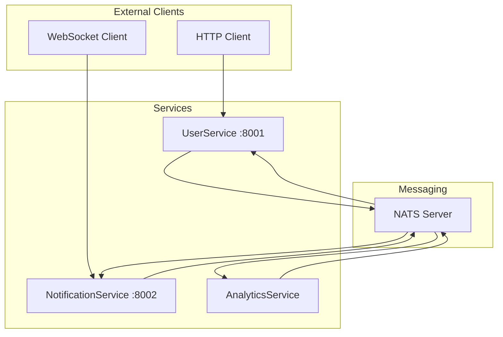

# E-commerce System Example

This comprehensive example demonstrates advanced NATS microservices features using a complete user management and notification system with HTTP APIs, schema validation, and real-time WebSocket communication.

## Overview

The e-commerce system example (`example_extended_services.py`) showcases:

- **HTTP/REST APIs** with FastAPI integration
- **Schema validation** using Pydantic models
- **WebSocket communication** for real-time updates
- **Broadcast/listener patterns** for event-driven architecture
- **Multi-protocol services** (NATS + HTTP + WebSocket)

## Architecture



## Services Overview

### UserService (Port 8001)

**Purpose**: Manages user registration and profile data

**Features**:
- HTTP REST API with automatic OpenAPI documentation
- Pydantic schema validation for all requests/responses
- NATS RPC methods for service-to-service communication
- Event broadcasting for user lifecycle events

**HTTP Endpoints**:
- `POST /api/users` - Create new user
- `GET /api/users/{user_id}` - Get user details
- `GET /health` - Health check
- `GET /info` - Service information
- `GET /docs` - Interactive API documentation

**RPC Methods**:
- `create_user(CreateUserRequest)` - Create user with validation
- `get_user(GetUserRequest)` - Retrieve user details

**Events Published**:
- `broadcast.usercreatedbroadcast` - When user is created
- `broadcast.useractivitybroadcast` - When user activity occurs

### NotificationService (Port 8002)

**Purpose**: Handles notifications and real-time communication

**Features**:
- WebSocket support for real-time notifications
- HTTP API for sending notifications
- Automatic relay of NATS events to WebSocket clients
- Event-driven notification processing

**HTTP Endpoints**:
- `POST /api/notify` - Send notification
- `GET /health` - Health check
- `GET /docs` - API documentation

**WebSocket Endpoints**:
- `WS /ws` - Real-time notification stream

**Events Handled**:
- `UserCreatedBroadcast` - Welcome new users
- `UserActivityBroadcast` - Track user activity

### AnalyticsService

**Purpose**: Collects and analyzes user and system metrics

**Features**:
- Event-driven analytics collection
- User behavior tracking
- System statistics aggregation

**RPC Methods**:
- `get_stats()` - Retrieve analytics data

## Message Schemas

All communication uses strongly-typed Pydantic schemas:

### Request/Response Models

```python
class CreateUserRequest(RPCRequest):
    username: str = Field(..., min_length=3, max_length=50)
    email: str = Field(..., pattern=r'^[\w\.-]+@[\w\.-]+\.\w+$')
    full_name: str

class CreateUserResponse(RPCResponse):
    user_id: str
    created_at: datetime

class UserResponse(RPCResponse):
    user_id: str
    username: str
    email: str
    full_name: str
    created_at: datetime
    last_active: Optional[datetime] = None
```

### Event Models

```python
class UserCreatedBroadcast(BroadcastMessage):
    user_id: str
    username: str
    email: str
    source_service: str

class UserActivityBroadcast(BroadcastMessage):
    user_id: str
    action: str
    details: dict = {}
```

## Running the Example

### Prerequisites

```bash
# Start NATS server with JetStream
docker run -d --name nats-server \
  -p 4222:4222 -p 8222:8222 \
  nats:alpine -js -m 8222
```

### Start All Services

```bash
# Run the complete e-commerce system
python example_extended_services.py
```

### Test the System

```bash
# Run integration tests
python example_extended_services.py test
```

## API Usage Examples

### Create User via HTTP

```bash
# Create a new user
curl -X POST "http://localhost:8001/api/users" \
  -H "Content-Type: application/json" \
  -d '{
    "username": "johndoe",
    "email": "john@example.com",
    "full_name": "John Doe"
  }'

# Response:
# {
#   "user_id": "user_1",
#   "created_at": "2024-01-01T12:00:00.123456",
#   "success": true,
#   "timestamp": "2024-01-01T12:00:00.123456"
# }
```

### Get User Details

```bash
curl "http://localhost:8001/api/users/user_1"
```

### Send Notification

```bash
curl -X POST "http://localhost:8002/api/notify" \
  -H "Content-Type: application/json" \
  -d '{
    "user_id": "user_1",
    "message": "Welcome to our platform!",
    "priority": "high"
  }'
```

## WebSocket Communication

### Connect to Real-time Notifications

```javascript
// JavaScript WebSocket client
const ws = new WebSocket('ws://localhost:8002/ws');

ws.onopen = () => {
    console.log('Connected to notification service');
    
    // Subscribe to user notifications
    ws.send(JSON.stringify({
        type: 'subscribe',
        user_id: 'user_1'
    }));
};

ws.onmessage = (event) => {
    const notification = JSON.parse(event.data);
    console.log('Notification:', notification);
};
```

### Python WebSocket Client

```python
import asyncio
import websockets
import json

async def websocket_client():
    uri = "ws://localhost:8002/ws"
    
    async with websockets.connect(uri) as websocket:
        # Subscribe to notifications
        await websocket.send(json.dumps({
            "type": "subscribe",
            "user_id": "user_1"
        }))
        
        # Listen for notifications
        async for message in websocket:
            notification = json.loads(message)
            print(f"Received: {notification}")

asyncio.run(websocket_client())
```

## RPC Communication Between Services

```python
# From another service, call UserService
from cliffracer import NATSService as Service, ServiceConfig

async def call_user_service():
    client = Service(ServiceConfig(name="client"))
    await client.connect()
    
    # Create user via RPC
    response = await client.call_rpc(
        "user_service",
        "create_user",
        username="janedoe",
        email="jane@example.com",
        full_name="Jane Doe"
    )
    
    print(f"User created: {response}")
    
    await client.disconnect()
```

## Event-Driven Workflow

1. **User Registration**:
   - Client sends POST to `/api/users`
   - UserService validates data and creates user
   - UserService broadcasts `UserCreatedBroadcast` event

2. **Automatic Notifications**:
   - NotificationService receives `UserCreatedBroadcast`
   - Welcome notification is created and sent
   - WebSocket clients receive real-time notification

3. **Analytics Tracking**:
   - AnalyticsService receives `UserCreatedBroadcast`
   - User statistics are updated
   - Event counts are incremented

4. **Activity Tracking**:
   - Any service can publish `activity.*` events
   - UserService tracks last activity time
   - ActivityBroadcast events are generated
   - WebSocket clients receive activity updates

## Key Features Demonstrated

### 1. Schema Validation

```python
@validated_rpc(CreateUserRequest, CreateUserResponse)
async def create_user(self, request: CreateUserRequest) -> CreateUserResponse:
    # Request is automatically validated
    # Response type is enforced
    pass
```

### 2. Broadcast/Listener Pattern

```python
# Publisher
@broadcast(UserCreatedBroadcast)
async def broadcast_user_created(self, user_id: str, username: str, email: str):
    return UserCreatedBroadcast(
        user_id=user_id,
        username=username,
        email=email,
        source_service=self.config.name
    )

# Listener
@listener(UserCreatedBroadcast)
async def on_user_created(self, message: UserCreatedBroadcast):
    print(f"Welcome {message.username}!")
```

### 3. Multi-Protocol Service

```python
class UserService(HTTPService):
    def __init__(self, config: ServiceConfig):
        super().__init__(config, port=8001)
        
        # Add HTTP endpoints
        @self.post("/api/users")
        async def create_user_http(request: CreateUserRequest):
            return await self.create_user(request)
    
    # NATS RPC method
    @validated_rpc(CreateUserRequest, CreateUserResponse)
    async def create_user(self, request: CreateUserRequest):
        # Same method available via HTTP and NATS
        pass
```

## Monitoring and Debugging

### API Documentation

- **UserService**: http://localhost:8001/docs
- **NotificationService**: http://localhost:8002/docs

### Health Checks

```bash
curl http://localhost:8001/health
curl http://localhost:8002/health
```

### Service Information

```bash
curl http://localhost:8001/info
# Returns: RPC methods, event handlers, broadcast methods
```

### NATS Monitoring

- **Dashboard**: http://localhost:8222
- **Connections**: http://localhost:8222/connz
- **Statistics**: http://localhost:8222/varz

## Error Handling and Validation

### Validation Errors

```bash
# Try invalid data
curl -X POST "http://localhost:8001/api/users" \
  -H "Content-Type: application/json" \
  -d '{
    "username": "ab",
    "email": "invalid-email",
    "full_name": ""
  }'

# Response:
# {
#   "success": false,
#   "error": "Validation error",
#   "traceback": "username: ensure this value has at least 3 characters..."
# }
```

## Integration with Database

For production use, extend the UserService to use a real database:

```python
class DatabaseUserService(UserService):
    def __init__(self, config: ServiceConfig, db_url: str):
        super().__init__(config)
        self.db = Database(db_url)
    
    async def create_user(self, request: CreateUserRequest):
        # Save to database instead of memory
        user_id = await self.db.create_user(
            username=request.username,
            email=request.email,
            full_name=request.full_name
        )
        
        await self.broadcast_user_created(
            user_id, request.username, request.email
        )
        
        return CreateUserResponse(
            user_id=user_id,
            created_at=datetime.utcnow()
        )
```

## Next Steps

1. **[Authentication](auth-patterns.md)** - Add RBAC and JWT authentication
2. **[Database Integration](database-integration.md)** - Connect to PostgreSQL/MongoDB
3. **[Monitoring Setup](monitoring-setup.md)** - Production monitoring with Zabbix
4. **[Deployment](../deployment/docker-compose.md)** - Deploy with Docker Compose
5. **[Testing](../testing/integration-tests.md)** - Comprehensive testing strategies

## Troubleshooting

### WebSocket Connection Issues

```bash
# Test WebSocket manually
wscat -c ws://localhost:8002/ws
```

### Schema Validation Errors

- Check Pydantic model definitions match request data
- Ensure required fields are provided
- Verify data types match schema expectations

### Event Delivery Issues

- Verify subject patterns match between publishers and listeners
- Check service names are correct in RPC calls
- Add delays between operations to allow async event processing
